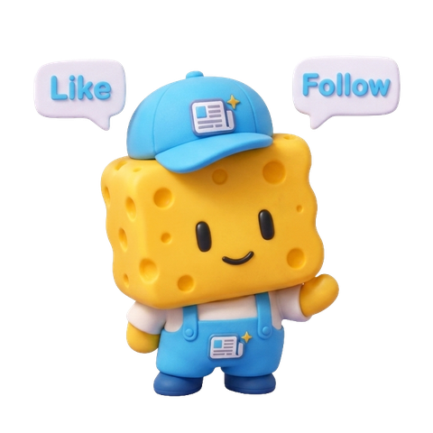

# sponge-dressup

> 스폰지타임즈 캐릭터에 모자·옷·액세서리·이름표·말풍선을 직접 골라 나만의 마스코트를 만드는 웹앱.
>
> Gemini 2.5 Flash Image (Nano Banana)로 3D Blender 스타일 PNG 생성 → 다운로드 → [obsidian-cardnews-skill](https://github.com/owenleekr/obsidian-cardnews-skill) 등 어디든 활용.

---

## 미리보기



베이스 캐릭터는 [스폰지클럽 1기](https://github.com/owenleekr/obsidian-cardnews-skill) 운영팀 자산. 메모지+✨ 심볼은 옷 가슴에 고정 (브랜드 마크). 모자는 완전 자유.

---

## 기능

- **4가지 커스텀 축** — 모자(10) · 옷(8) × 색(8) · 액세서리(9) · 이름표 · 말풍선 좌우
- **3D Blender 스타일** — 매트한 토이 피겨 톤, 투명 배경 PNG
- **AAA Design System v1.0** — 미니멀 3색, Pretendard
- **즉시 다운로드** — 생성 후 한 번 클릭으로 PNG

---

## 로컬 개발

```bash
git clone https://github.com/owenleekr/sponge-dressup.git
cd sponge-dressup
npm install
cp .env.example .env.local
# .env.local 에 GEMINI_API_KEY 입력
npm run dev
```

http://localhost:3001 접속.

### Gemini API 키 발급

1. https://aistudio.google.com/apikey 에서 키 생성
2. **결제 활성화 필수** (이미지 생성은 free tier 미포함)
   - 키 우측 "Plan" → "Tier 1 (paid)" 로 업그레이드
3. 사용량 한도 권장:
   - 예산 알림: 월 $20~30
   - API 쿼터: 일 200~300건

### 비용

- Gemini 2.5 Flash Image: 장당 약 **$0.039**
- 70명 × 3장 평균 = 약 **$8-10 전체**
- 옵션별 썸네일 35장 한 번 생성: 약 **$1.40** (재생성 안 함, 캐싱됨)

### 썸네일 (옵션 미리보기) 재생성

옵션을 추가/수정한 경우, 썸네일 재생성:

```bash
npm run thumbs
```

기존 PNG가 있으면 건너뜀. 새로 추가한 옵션만 생성. `public/thumbs/{hats,outfits,accessories}/{id}.png`

---

## 배포 (Vercel)

```bash
vercel --prod
```

또는 GitHub 연동 후 자동 배포. **환경변수 `GEMINI_API_KEY` 필수**.

---

## 디자인 원칙

1. **본체 고정** — 노란 큐브 스폰지 + 메모지+✨ 심볼 = 스폰지타임즈 IP
2. **모자는 자유** — 메모지 안 들어감 (브랜드 마크는 옷에만)
3. **이름표·말풍선 영문 권장** — Gemini가 한글 텍스트는 종종 실패

---

## 라이선스 / IP

- **앱 코드**: MIT
- **스폰지타임즈 캐릭터 / 메모지 심볼**: 스폰지클럽 1기 운영팀 자산.
  외부 사용 시 운영팀 양해 필요.
- **만든이**: 오웬 ([@owenleekr](https://github.com/owenleekr))

---

## 연관 프로젝트

- [obsidian-cardnews-skill](https://github.com/owenleekr/obsidian-cardnews-skill) — 옵시디언 미션 제출을 인스타 카드뉴스로 변환. 여기서 만든 캐릭터를 카드뉴스 마스코트로 사용 가능.
